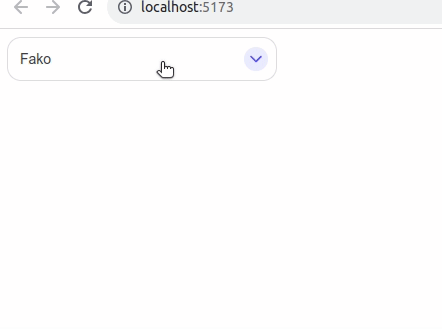

# select-vue3

[](https://choosealicense.com/licenses/mit/)

A simple select component for vuejs 3.You can search with partial match in list options.

## Demo



## Installation

Install select-vue3 with npm

```bash
npm install select-vue3
```

## Usage/Examples

```vue
<script setup>
import { AppSelect } from "select-vue3";

const options = [
  {
    id: 0,
    label: "Aaren",
  },
  {
    id: 1,
    label: "Abagael",
  },
  {
    id: 2,
    label: "Abbe",
  },
  {
    id: 3,
    label: "Abbi",
  },
  {
    id: 4,
    label: "Abbie",
  },
  {
    id: 5,
    label: "Abigale",
  },
];

function handleOptionsSelected(d) {
  console.log(d); // output: option selected from AppSelect
}
</script>

<template>
  <AppSelect :options="options" @get-option-selected="handleOptionsSelected" />
</template>
```

## Authors

- [dodaxx](https://www.github.com/dodaxx)

## Contributors

- [hantsaniala](https://www.github.com/hantsaniala)

## TODOS

- Custom design
